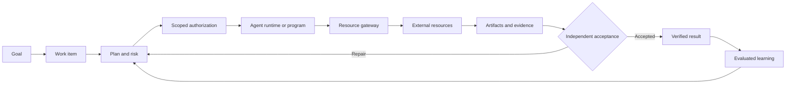

<div align="center">

# TaskSeal

### A task-first control plane for trustworthy agent work

**Authorize · Execute · Prove · Improve**

[](./ROADMAP.md)
[](https://github.com/lexiewenchuan/TaskSeal/actions/workflows/validate.yml)
[](./LICENSE)
[](./README.zh-CN.md)
[](./CONTRIBUTING.md)

**An agent saying “done” does not mean the task is done.**

TaskSeal turns a goal into an authorized work item, coordinates agents and
tools, collects evidence, and closes the task only after independent acceptance.

[Why TaskSeal](#why-taskseal) · [Architecture](#architecture) ·
[Explore the design](#explore-the-design) · [Roadmap](./ROADMAP.md) ·
[Contributing](./CONTRIBUTING.md)

</div>


> [!IMPORTANT]
> TaskSeal is currently a **design preview with executable contracts**, not a
> production-ready runtime. The repository intentionally separates what is
> designed, specified, and implemented.

## Why TaskSeal?

Most agent frameworks are excellent at helping an agent reason, call tools, and
coordinate a run. Real work introduces a second problem:

- Who authorized the action?
- Which resources may the agent change?
- What survives when a model, session, or runtime changes?
- What evidence proves the external result is correct?
- How can successful experience become a reusable capability without unsafe
  self-modification?

TaskSeal treats the **work item**, rather than the conversation or agent loop, as
the system's top-level object.

```text
Goal
  → Work item
  → Context and plan
  → Risk check and scoped authorization
  → Agent or deterministic executor
  → Artifacts and evidence
  → Independent acceptance
  → Verified experience
  → Evaluated capability
```

## The core idea

TaskSeal combines four closed loops:

| Loop | Question it answers |
|---|---|
| **Decide** | What should be done, reused, changed, or created? |
| **Act** | Who may perform which action on which resource? |
| **Prove** | What evidence demonstrates that the goal was achieved? |
| **Improve** | Which verified experience is safe to promote into a capability? |

The first three loops make the current task trustworthy. The fourth helps future
tasks improve without bypassing authorization or evaluation.

## Architecture



The runtime is replaceable. Codex, LangGraph, an Agents SDK, a custom loop, or a
deterministic program can all act as executors. TaskSeal owns the durable work
state, authorization boundary, evidence model, acceptance decision, and
controlled learning path.

For the complete design, see:

- [Framework design](./docs/general-agent-framework-design.md)
- [Interview-friendly project narrative](./docs/interview-project-agent-work-os.md)
- [Detailed architecture diagram](./outputs/agent-work-os-interview-architecture-v1.0.svg)
- [Six-plane design diagram](./outputs/general-agent-framework-architecture-v0.3.svg)

## Explore the design

The fastest way to understand TaskSeal is to inspect one work item:

1. Open the [example software-change work item](./examples/software-change/work-item.json).
2. Compare it with the [Work Item JSON Schema](./spec/work-item.schema.json).
3. Follow the acceptance criteria to the attached evidence records.
4. Read the [framework design](./docs/general-agent-framework-design.md) for the
   complete model.

Validate the example with any JSON Schema 2020-12 compatible validator:

```bash
check-jsonschema \
  --schemafile spec/work-item.schema.json \
  examples/software-change/work-item.json
```

No model provider or agent runtime is required to explore the contract.

## What makes it different?

TaskSeal is designed to sit above agent runtimes, not replace them.

| Concern | Agent runtime | TaskSeal |
|---|---:|---:|
| Model and tool loop | Primary | Pluggable |
| Durable task state | Optional | Core |
| Resource-scoped authorization | Runtime-specific | Core |
| Side-effect gateway | Tool-specific | Unified boundary |
| Evidence-to-criterion traceability | Usually external | Core |
| Independent acceptance | Optional | Required |
| Capability promotion and rollback | Usually external | Controlled lifecycle |

TaskSeal is useful when an agent moves beyond answering questions and starts
changing code, documents, data, tickets, infrastructure, or other shared
resources.

## Design invariants

1. An agent cannot grant itself more authority.
2. Task state cannot live only in chat history.
3. Real side effects pass through a controlled resource boundary.
4. Execution success is not task completion.
5. An artifact does not automatically count as evidence.
6. Deterministic checks are preferred where they are sufficient.
7. High-risk work requires independent acceptance.
8. Retrieved memory is not automatically a fact.
9. One successful run does not automatically become a capability.
10. Self-improvement must be evaluated, reversible, and explicitly promoted.

## Repository map

```text
TaskSeal/
├── docs/          # Detailed architecture and design reasoning
├── examples/      # Sanitized work-item examples
├── outputs/       # Architecture diagrams in SVG and PNG
├── spec/          # Runtime-neutral contracts
└── .github/       # Contribution and issue workflows
```

## Project status

TaskSeal is at **v0.1 design preview**.

Available now:

- a runtime-neutral architecture;
- a task-first ontology;
- a Work Item contract and example;
- authorization, evidence, acceptance, and growth boundaries;
- diagrams and interview-ready explanations.

Next milestones include a reference state machine, policy evaluator, local
resource gateway, evidence verifier, and one end-to-end software-change demo.
See the [roadmap](./ROADMAP.md).

## Contributing

TaskSeal welcomes design critiques, use cases, contract improvements, reference
adapters, and evaluation ideas. Start with
[CONTRIBUTING.md](./CONTRIBUTING.md), or open a design proposal using the issue
template.

Please read the [Code of Conduct](./CODE_OF_CONDUCT.md) and
[Security Policy](./SECURITY.md) before contributing.

## License

Licensed under the [Apache License 2.0](./LICENSE).
