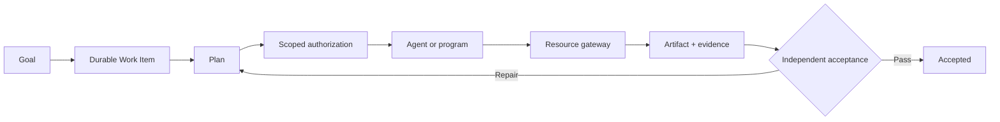

<div align="center">

# TaskSeal

### A task-first control plane for trustworthy agent work

**Authorize · Execute · Prove · Accept**

[](https://github.com/lexiewenchuan/TaskSeal/actions/workflows/validate.yml)
[](./pyproject.toml)
[](./LICENSE)
[](./README.zh-CN.md)

**An agent saying “done” does not mean the task is done.**

TaskSeal gives agent work durable state, limited authority, controlled side
effects, revision-bound evidence, and independent acceptance.

[Quick start](#quick-start) · [How it works](#how-it-works) ·
[Python API](#python-api) · [Architecture](./docs/architecture.md) ·
[Roadmap](./ROADMAP.md) · [Changelog](./CHANGELOG.md)

</div>

## Quick start

TaskSeal has no third-party runtime dependencies.

```bash
git clone https://github.com/lexiewenchuan/TaskSeal.git
cd TaskSeal
python3 -m venv .venv
source .venv/bin/activate
python -m pip install -e .
```

Run a complete local task:

```bash
taskseal demo
```

The demo:

1. creates a durable Work Item;
2. plans a file change;
3. grants one agent read/write access to one local resource;
4. writes only through the checked resource gateway;
5. captures a SHA-256 revision as evidence;
6. uses a different verifier to accept the task;
7. persists every checkpoint and event to SQLite.

Inspect the result:

```bash
taskseal list
taskseal show <work-item-id>
taskseal events <work-item-id>
```

The final state is:

```json
{
  "status": "accepted",
  "acceptance": [
    {
      "id": "result-created",
      "status": "passed",
      "verified_by": "demo-verifier"
    }
  ]
}
```

## Why TaskSeal?

Agent runtimes solve how a model reasons and calls tools. Real work also needs
to answer:

- Who authorized this action?
- Which exact resource may the executor change?
- Can a child agent gain more authority than its parent?
- What survives when the process or conversation ends?
- What evidence proves that the external result is correct?
- Can the executor approve its own high-impact work?

TaskSeal makes the **Work Item**, not the conversation, the top-level object.

## How it works



The agent runtime is replaceable. TaskSeal owns the boundaries around it.

## What is implemented

- A legal Work Item state machine
- Resource- and action-scoped authorization
- Explicit trusted grantors and recorded authorization provenance
- Non-expanding child delegation
- Authorization revocation
- Authorization expiry checks
- A local filesystem side-effect gateway
- Workspace and resource path-escape protection
- Artifact and SHA-256 evidence generation
- Evidence-to-criterion traceability
- Registered evidence verifiers that re-check external resources
- Trusted, independent verifier enforcement
- Domain validation before persistence
- SQLite snapshots with optimistic revisions
- An append-only task event trail
- A zero-dependency CLI demo
- Unit and end-to-end tests

TaskSeal is an early alpha. The implemented surface is deliberately small and
tested; planned distributed and multi-runtime capabilities are listed in the
[roadmap](./ROADMAP.md).

## Python API

```python
from pathlib import Path

from taskseal import (
    AcceptanceCriterion,
    Acceptor,
    AuthorizationRequest,
    FileSha256EvidenceVerifier,
    LocalFileGateway,
    PlanStep,
    PolicyEngine,
    Resource,
    SQLiteWorkItemStore,
    TaskSealEngine,
    WorkItem,
)

store = SQLiteWorkItemStore(Path(".taskseal/taskseal.db"))
policy = PolicyEngine(trusted_authorizers={"owner"})
acceptor = Acceptor(
    trusted_verifiers={"independent-verifier"},
    evidence_verifiers={
        "file-sha256": FileSha256EvidenceVerifier(Path("."))
    },
)
engine = TaskSealEngine(store, policy=policy, acceptor=acceptor)

work = WorkItem.create(
    goal="Create a verified result file.",
    requested_by="user",
    resources=[
        Resource(
            id="workspace",
            kind="local-directory",
            locator=".",
            allowed_actions=["read", "write"],
        )
    ],
    acceptance=[
        AcceptanceCriterion(
            id="result-exists",
            statement="The result has revision-bound evidence.",
            required_evidence_kinds=["file-sha256"],
        )
    ],
)

engine.create(work)
engine.set_plan(work, [PlanStep(id="write", summary="Write result")])
engine.request_authorization(work)
grant = engine.grant(
    work,
    AuthorizationRequest(
        subject="agent",
        resource_ids=["workspace"],
        actions=["write"],
    ),
    granted_by="owner",
)
engine.start(work, executor="agent")

artifact, evidence = LocalFileGateway(Path("."), policy).write_text(
    work,
    authorization_id=grant.id,
    subject="agent",
    resource_id="workspace",
    relative_path="result.txt",
    content="done\n",
    supports=["result-exists"],
)
engine.attach_result(work, artifact=artifact, evidence=evidence)
engine.complete_step(work, step_id="write", executor="agent")
engine.begin_verification(work)
engine.accept(work, verifier="independent-verifier")
```

## Core invariants

1. Root grants require a configured trusted authorizer.
2. A subject cannot authorize itself.
3. Delegation cannot expand resources, actions, or expiry.
4. Task state does not live only in chat history.
5. Side effects pass through a checked resource gateway.
6. A successful execution is not task acceptance.
7. Artifacts do not automatically count as evidence.
8. Evidence is re-checked against its external resource before acceptance.
9. An executor cannot independently accept its own work.
10. Invalid or empty Work Items cannot be persisted.

## Project structure

```text
TaskSeal/
├── src/taskseal/
│   ├── models.py       # Work Item and trust objects
│   ├── state.py        # legal lifecycle transitions
│   ├── policy.py       # scoped authorization and delegation
│   ├── gateway.py      # checked filesystem side effects
│   ├── acceptance.py   # evidence-backed acceptance
│   ├── store.py        # SQLite snapshots and events
│   ├── engine.py       # lifecycle coordinator
│   └── cli.py          # runnable command line
├── tests/              # unit and end-to-end tests
├── spec/               # runtime-neutral Work Item schema
├── examples/           # sanitized contract examples
├── docs/               # technical architecture
└── CHANGELOG.md        # version history
```

## Development

```bash
PYTHONPATH=src python -m unittest discover -s tests -v
PYTHONPATH=src python -m taskseal --help
```

See [CONTRIBUTING.md](./CONTRIBUTING.md) before submitting a change.

## License

Apache License 2.0. See [LICENSE](./LICENSE).
