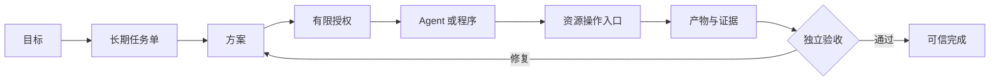

<div align="center">

# TaskSeal

### 面向可信 Agent 工作的任务控制框架

**授权 · 执行 · 证明 · 验收**

[](https://github.com/lexiewenchuan/TaskSeal/actions/workflows/validate.yml)
[](./pyproject.toml)
[](./LICENSE)
[](./README.md)

**Agent 说“完成了”，不代表任务真的完成。**

TaskSeal 为 Agent 工作提供长期任务状态、有限授权、统一副作用入口、
绑定资源版本的证据，以及独立验收。

</div>

## 快速开始

TaskSeal 运行时没有第三方依赖：

```bash
git clone https://github.com/lexiewenchuan/TaskSeal.git
cd TaskSeal
python3 -m venv .venv
source .venv/bin/activate
python -m pip install -e .
taskseal demo
```

查看持久化结果：

```bash
taskseal list
taskseal show <work-item-id>
taskseal events <work-item-id>
```

Demo 会真实跑完：

```text
建立任务单
→ 制定方案
→ 对一个本地目录发放有限读写权限
→ 通过资源入口写文件
→ 生成绑定 SHA-256 的证据
→ 由不同的验证者执行验收
→ 把任务和事件保存到 SQLite
```

## 已经实现

- 任务状态机与非法状态拦截
- 面向资源和动作的有限授权
- 子 Agent 授权不能超过父授权
- 授权有效期检查
- 本地文件资源操作入口
- 工作区与资源目录防逃逸
- Artifact 与 SHA-256 Evidence
- 证据与验收项的对应关系
- 执行者不能独立验收自己的结果
- SQLite 任务快照、版本冲突检查和事件记录
- 零依赖 CLI Demo
- 单元测试和端到端测试

项目当前处于早期 Alpha。已经写出的能力都有代码和测试；尚未实现的
分布式调度、多 Runtime 适配和更多资源网关放在
[ROADMAP](./ROADMAP.md) 中。

## 核心流程



Agent Runtime 可以替换。TaskSeal 负责它外面的任务、权限、资源、证据
和验收边界。

## 代码结构

```text
src/taskseal/
├── models.py       # 任务单和信任对象
├── state.py        # 合法状态流转
├── policy.py       # 有限授权与委派
├── gateway.py      # 受控文件副作用
├── acceptance.py   # 证据验收
├── store.py        # SQLite 状态与事件
├── engine.py       # 生命周期协调
└── cli.py          # 可运行命令行
```

完整模块关系见[技术架构](./docs/architecture.md)。

## 开发

```bash
PYTHONPATH=src python -m unittest discover -s tests -v
PYTHONPATH=src python -m taskseal --help
```

参与开发前请阅读 [CONTRIBUTING.md](./CONTRIBUTING.md)。

## 许可证

使用 [Apache License 2.0](./LICENSE) 开源。
