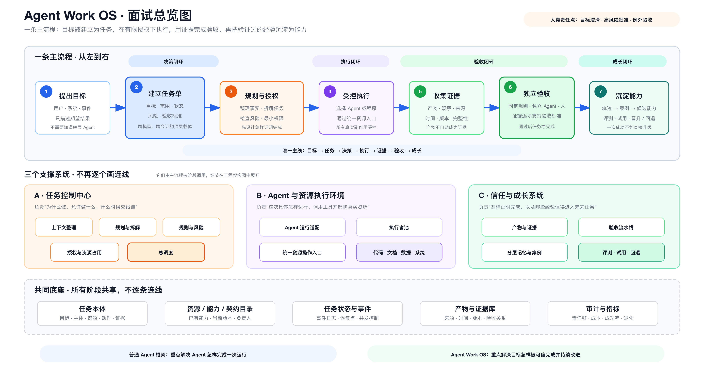
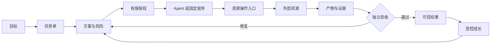

<div align="center">

# TaskSeal

### 面向可信 Agent 工作的任务控制框架

**授权 · 执行 · 证明 · 进化**

[](./ROADMAP.md)
[](https://github.com/lexiewenchuan/TaskSeal/actions/workflows/validate.yml)
[](./LICENSE)
[](./README.md)
[](./CONTRIBUTING.md)

**Agent 说“完成了”，不代表任务真的完成。**

TaskSeal 把目标变成有边界的任务单，协调 Agent 与工具执行，收集证据，
并且只在独立验收通过后关闭任务。

[核心思想](#核心思想) · [架构](#架构) ·
[五分钟了解](#五分钟了解-taskseal) · [路线图](./ROADMAP.md) ·
[参与贡献](./CONTRIBUTING.md)

</div>



> [!IMPORTANT]
> TaskSeal 当前是带有可检查契约的**设计预览版**，还不是生产级运行时。
> 仓库会明确区分“已经设计”“已经定义”和“已经实现”的能力。

## 为什么需要 TaskSeal

常见 Agent 框架主要解决模型怎样思考、调用工具和完成一次运行。
当 Agent 开始修改代码、文档、数据和外部系统时，还需要回答：

- 谁允许它执行这次操作？
- 它具体可以修改哪些资源？
- 更换模型、会话或运行环境后，任务怎样继续？
- 有什么证据证明外部结果真的正确？
- 成功经验怎样安全地成为新能力，而不是让系统自由修改自己？

因此，TaskSeal 不把 Agent 或对话作为系统中心，而把长期存在的
**任务单（Work Item）**作为顶层对象。

## 核心思想

```text
目标
  → 任务单
  → 上下文与方案
  → 风险检查与有限授权
  → Agent 或固定程序执行
  → 产物与证据
  → 独立验收
  → 可信结果
  → 经过评测的能力成长
```

框架包含四个闭环：

| 闭环 | 回答的问题 |
|---|---|
| **决策** | 应该做什么，哪些能力应该复用、扩展、修复或新建？ |
| **执行** | 谁可以在什么范围内对哪些资源做什么？ |
| **验收** | 什么证据能够证明目标已经达成？ |
| **成长** | 哪些经过验证的经验可以安全晋升为正式能力？ |

前三个闭环保证当前任务可信完成，第四个闭环帮助未来任务逐步变好。

## 架构



Agent Runtime 是可替换的执行者。Codex、LangGraph、Agents SDK、自定义
Agent Loop 或固定程序都可以接入。TaskSeal 负责跨运行时任务状态、
权限边界、证据模型、验收决定和受控成长。

详细材料：

- [通用框架设计](./docs/general-agent-framework-design.md)
- [面试项目讲解](./docs/interview-project-agent-work-os.md)
- [详细工程架构图](./outputs/agent-work-os-interview-architecture-v1.0.svg)
- [完整六层设计图](./outputs/general-agent-framework-architecture-v0.3.svg)

## 五分钟了解 TaskSeal

1. 打开[软件变更任务示例](./examples/software-change/work-item.json)。
2. 对照 [Work Item JSON Schema](./spec/work-item.schema.json)。
3. 查看每条验收标准怎样绑定证据，而不是只相信 Agent 的完成声明。
4. 阅读[通用框架设计](./docs/general-agent-framework-design.md)了解完整模型。

可以使用任意支持 JSON Schema 2020-12 的工具检查示例：

```bash
check-jsonschema \
  --schemafile spec/work-item.schema.json \
  examples/software-change/work-item.json
```

## 与常见 Agent 框架的关系

TaskSeal 位于 Agent Runtime 之上，不重复实现模型调用和 Agent Loop。

| 关注点 | Agent Runtime | TaskSeal |
|---|---:|---:|
| 模型与工具循环 | 主要职责 | 可插拔 |
| 长期任务状态 | 可选 | 核心 |
| 面向资源的有限授权 | 各自实现 | 核心 |
| 真实副作用入口 | 工具级 | 统一边界 |
| 证据与验收项的对应关系 | 通常在外部 | 核心 |
| 独立验收 | 可选 | 必须 |
| 能力晋升与回退 | 通常在外部 | 受控生命周期 |

## 当前状态

TaskSeal 当前处于 **v0.1 设计预览阶段**，已经提供：

- 与运行环境无关的总体架构；
- 任务优先的本体设计；
- Work Item 契约与示例；
- 授权、证据、验收和成长边界；
- 完整架构图和面试讲解材料。

下一阶段将实现参考状态机、策略判断器、本地资源入口、证据验证器，
以及一个端到端的软件变更示例。详情见[路线图](./ROADMAP.md)。

## 参与贡献

欢迎提交设计讨论、使用场景、契约改进、Runtime 适配器和评测方案。
请先阅读 [CONTRIBUTING.md](./CONTRIBUTING.md)、
[行为准则](./CODE_OF_CONDUCT.md)和[安全策略](./SECURITY.md)。

## 许可证

使用 [Apache License 2.0](./LICENSE) 开源。
