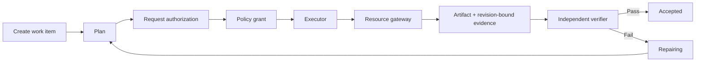

# TaskSeal Architecture

TaskSeal is a small reference kernel for trustworthy agent work. It does not
implement a model loop. It wraps an agent or deterministic executor with durable
task state, scoped authority, a controlled side-effect boundary, evidence, and
independent acceptance.

## Runtime flow



## Components

| Component | Responsibility | Source |
|---|---|---|
| Work Item | Durable goal, scope, plan, authority, artifacts, evidence and acceptance | `src/taskseal/models.py` |
| State machine | Legal lifecycle transitions | `src/taskseal/state.py` |
| Policy engine | Non-expanding resource and action grants | `src/taskseal/policy.py` |
| Resource gateway | Checked filesystem side effects and revision capture | `src/taskseal/gateway.py` |
| Acceptor | Evidence-to-criterion verification and executor separation | `src/taskseal/acceptance.py` |
| Store | SQLite snapshots, optimistic revisions and event trail | `src/taskseal/store.py` |
| Engine | Coordinates the lifecycle without owning the agent loop | `src/taskseal/engine.py` |
| CLI | Runnable demo and state inspection | `src/taskseal/cli.py` |

## Trust boundaries

### Authority

An authorization binds:

```text
grantor + subject + resources + actions + expiry
```

A root grant must be issued by a configured trusted authorizer, and a subject
cannot authorize itself. A delegated grant must be a subset of its parent. A
grant cannot introduce a new resource, action, or longer expiry.

Free-form authorization conditions are reserved for a future executable policy
contract. The current kernel rejects them instead of storing unenforced
security promises.

### Side effects

Executors do not write resources directly. `LocalFileGateway` re-checks the
authorization at action time, resolves the resource root, and rejects path
escape before writing.

The first adapter is intentionally local and small. Additional adapters should
preserve the same boundary rather than bypass it.

### Evidence

A successful function return is not acceptance evidence. The gateway emits:

- an artifact describing what was produced;
- a SHA-256 resource revision;
- an evidence record declaring which criterion it supports;
- the collector and observation time.

Before acceptance, a registered evidence verifier finds the matching artifact,
re-reads the external file, recomputes its SHA-256 digest, and compares the
current resource, artifact and evidence revisions. Unknown evidence kinds fail
closed until a verifier is registered for them.

### Acceptance

The acceptor requires a configured trusted verifier and every criterion to have
matching evidence kinds, criterion support, a matching artifact, and a
re-verified resource revision. An executor cannot be the independent verifier
for its own work.

## Durable state

SQLite stores both the current Work Item snapshot and an append-only event
trail. Updates use an expected revision so stale writers cannot silently
overwrite newer task state.

The runtime model, CLI output, persisted snapshot, example and JSON Schema use
the same versioned Work Item contract. Domain validation rejects empty
acceptance criteria, duplicate identifiers, broken references, illegal initial
state, and accepted tasks with incomplete work.

This is a reference implementation, not a distributed consensus system.
Distributed deployments will need a shared database, leases, and stronger
resource conflict control.

## Runtime adapters

Any runtime can drive `TaskSealEngine`:

```text
Codex / Agents SDK / LangGraph / custom loop / deterministic worker
                              │
                              ▼
                       TaskSealEngine
                              │
                 Policy + Gateway + Evidence
```

The runtime decides how one execution reasons and calls tools. TaskSeal decides
whether that execution is authorized and whether the overall task can be
accepted.
