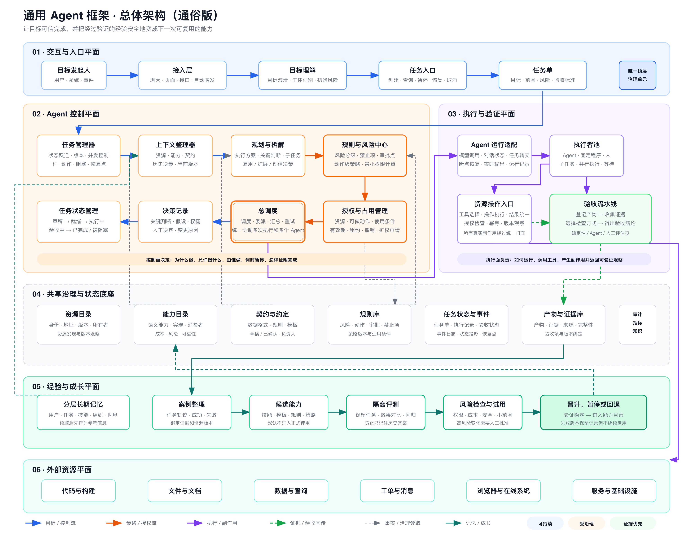
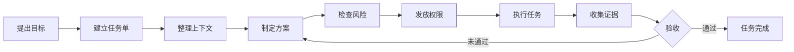
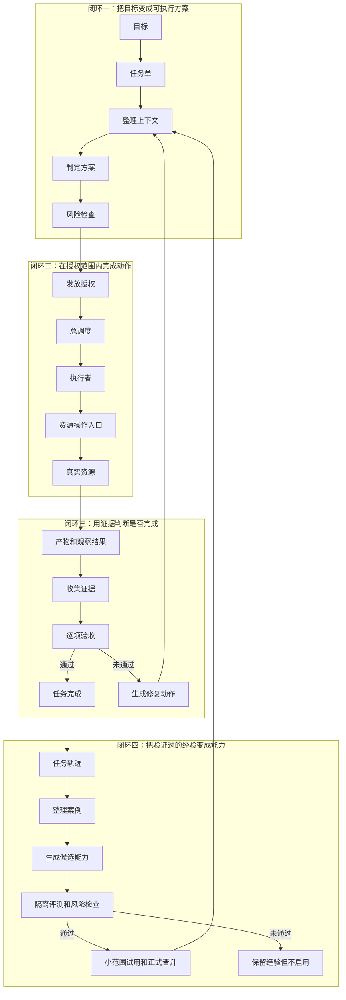
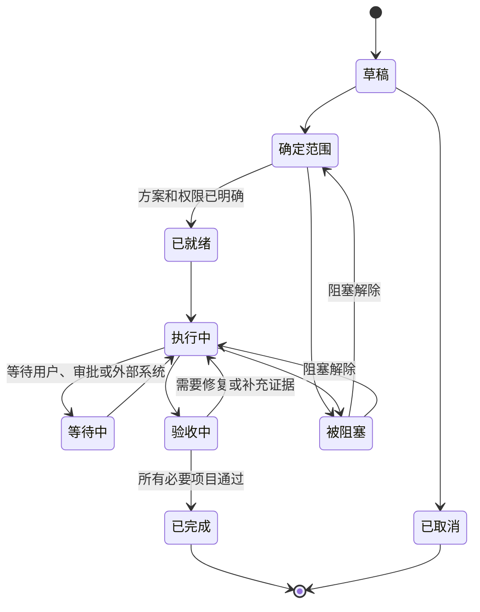
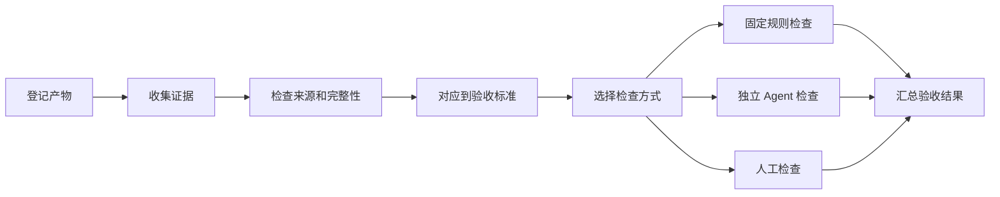
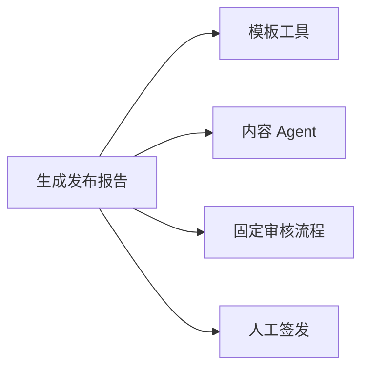
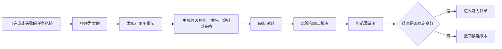

# TaskSeal 通用 Agent 框架设计

> 状态：讨论稿 v0.5
> 目标：让一个目标经过规划、授权、执行和验收，最终变成可信的结果，并让通过验证的经验成为下一次可复用的能力。
> 当前只讨论设计，不进入技术实现。

面试展示入口：[TaskSeal：面试项目说明](./interview-project-agent-work-os.md)

## 1. 我们要设计什么

我们要设计的不是一个更聪明的聊天机器人，也不是另一个模型调用框架。

我们要解决的是：

> 当 Agent 开始真正修改代码、编辑文档、查询数据、处理工单、操作系统时，怎样让它既能自主工作，又不会失控，并且能够证明事情真的完成了。

整个过程可以通俗地理解成：

```text
有人提出目标
→ 系统建立任务单
→ 找到相关资料和已有能力
→ 制定执行方案
→ 检查风险并发放权限
→ 选择 Agent 或固定程序执行
→ 收集产物和证据
→ 独立检查结果
→ 通过验收后才算完成
→ 从任务轨迹中整理经验
→ 经过评测后沉淀为可复用能力
```

这个框架最重要的区别是：

> 其他框架主要帮助 Agent 做事；我们的框架负责让 Agent 做的事情可信、可控、可追溯，并在不失控的前提下逐步变好。

---

## 2. 总体架构



[查看 SVG 架构图](../outputs/general-agent-framework-architecture-v0.3.svg)

整个框架分成六层：

| 层次 | 解决的问题 |
|---|---|
| 交互与入口 | 谁提出了什么目标 |
| Agent 控制中心 | 为什么做、怎么拆、允许做什么、由谁做 |
| 执行与验收 | Agent 怎样执行，结果怎样检查 |
| 共享底座 | 资源、能力、规则、状态和证据放在哪里 |
| 经验与成长 | 已验证的经验怎样变成候选能力，并安全进入正式使用 |
| 外部资源 | Agent 实际读取或修改的对象 |

### 2.1 一次任务的完整过程



任务没有通过验收时，不是简单告诉 Agent“再试一次”，而是明确：

- 哪一项没有通过；
- 是执行失败，还是证据不足；
- 是否需要修改方案；
- 是否需要新增权限；
- 是否需要人工决定；
- 下一步应该由谁处理。

### 2.2 框架其实由四个闭环组成

如果只看组件，很容易觉得系统很复杂。换成四个闭环以后会直观很多。



四个闭环分别回答：

1. **决策闭环**：我们准备怎样完成目标？
2. **执行闭环**：Agent 在什么权限下做了什么？
3. **验收闭环**：有什么证据证明结果成立？
4. **成长闭环**：哪些经验值得复用，怎样证明新能力比原来更好？

前三个闭环服务于当前任务，第四个闭环服务于未来任务。

成长闭环不能反过来绕过前三个闭环。它可以提出新的技能、规则、模板或调度策略，但不能自行扩大权限、直接修改生产环境，也不能自己宣布升级成功。

### 2.3 四个最容易混淆的角色

| 角色 | 它只回答什么 | 不应该负责什么 |
|---|---|---|
| 任务管理器 | 任务现在是什么状态，下一步是什么 | 不负责想具体方案 |
| 规划模块 | 为了完成目标，应该做哪些事情 | 不负责直接执行 |
| 总调度 | 什么时候让谁执行哪一步 | 不负责决定自己有没有权限 |
| Agent 运行环境 | 某一次执行内部怎样调用模型和工具 | 不负责宣布整个任务完成 |

可以把它们记成：

```text
任务管理器管“事情走到哪里”
规划模块管“准备怎么做”
总调度管“谁在什么时候做”
Agent 运行环境管“这一次具体怎么跑”
```

### 2.4 十条不能被打破的规则

无论以后采用什么技术实现，都必须保持：

1. Agent 不能自己扩大权限。
2. 任务状态不能只存在于聊天记录。
3. 所有真实副作用都必须经过统一资源入口。
4. 执行成功不等于任务完成。
5. 产物不能自动成为证据。
6. 能固定检查的内容，不只交给模型判断。
7. 高风险任务的生成者不能成为唯一验收者。
8. 记忆中出现过的内容不能自动成为事实。
9. 完成一次任务不能自动生成正式能力。
10. Agent 对自身的修改必须经过隔离评测、风险检查和可回退发布。

---

## 3. 第一层：交互与入口

这一层负责接住用户、系统或事件提出的目标。

### 3.1 目标发起人

目标发起人可以是：

- 用户；
- 业务系统；
- 定时任务；
- 监控告警；
- 另一个任务；
- 上级 Agent。

目标发起人只需要描述希望得到什么结果，不需要知道底层工具名称、Agent 名称或执行步骤。

例如：

- “分析这次线上故障的根因，并给出证据。”
- “把这份文档更新成新的产品方案。”
- “修复登录失败的问题，并验证没有影响其他功能。”
- “每天检查异常订单，有问题时通知负责人。”

### 3.2 接入层

接入层负责支持不同入口：

- 聊天；
- 页面；
- 接口；
- 命令行；
- 定时触发；
- 事件触发。

它只负责把不同形式的请求转成统一格式，不负责规划，也不负责发权限。

系统可以主动发现值得处理的事情，例如监控异常、任务长期没有进展、资源版本变化或约定时间到达。

但“主动发现”不等于“主动执行”：

```text
发现信号
→ 判断是否值得建立任务
→ 形成任务建议或任务单
→ 按正常流程检查风险和权限
→ 才能执行
```

主动模块没有独立于任务体系之外的长期权限。低价值提醒应该被抑制，避免系统因为“主动”而不断制造噪声和无意义任务。

### 3.3 目标理解

目标理解模块负责把自然语言整理成一个清楚的目标。

它需要回答：

- 谁提出了目标；
- 希望什么结果发生；
- 涉及哪些对象；
- 有哪些明确限制；
- 哪些地方存在歧义；
- 是否包含删除、发布、生产修改等高风险动作。

如果缺少的信息会明显改变方案或风险，就向用户澄清；如果只是轻微细节，可以先按合理假设推进，并把假设记录下来。

### 3.4 任务入口

任务入口负责创建和管理任务单。

用户可以通过它：

- 创建任务；
- 查看进度；
- 补充信息；
- 批准高风险操作；
- 暂停或恢复；
- 取消任务；
- 查看产物和验收结果。

任务入口只展示经过控制中心确认的状态，不直接暴露某个模型内部的思考过程。

---

## 4. 任务单：整个框架的核心对象

一个目标进入系统后，会形成一张任务单。

任务单不是聊天记录，也不是一次 Agent 执行。它是整个目标从开始到结束的长期载体。

一张任务单至少要说明：

- 目标是什么；
- 哪些内容在范围内；
- 哪些内容明确不能做；
- 当前风险有多高；
- 准备采用什么方案；
- 需要哪些权限；
- 当前由谁执行；
- 已经产生了哪些产物；
- 有哪些证据；
- 哪些验收项已经通过；
- 当前阻塞在哪里；
- 下一步要做什么。

### 4.1 为什么任务单不能等同于聊天

聊天可能被压缩、截断或更换会话。

任务单必须能够：

- 换一个 Agent 后继续；
- 换一个模型后继续；
- 暂停几天后继续；
- 从失败处恢复；
- 查看历史决定；
- 知道外部资源是否已经发生变化。

### 4.2 为什么任务单不能等同于一次执行

一个任务可能包含多次执行：

```text
第一次：调查问题
第二次：修改内容
第三次：运行检查
第四次：根据失败结果修复
第五次：重新验收
```

其中某一次执行成功，只能说明这一步结束了，不能说明整个任务完成。

---

## 5. 第二层：Agent 控制中心

控制中心是框架的大脑，但它不是一个什么都做的超级 Agent。

它由几个职责清晰的部分组成。

### 5.1 任务管理器

任务管理器负责维护任务单的一致状态。

它主要处理：

- 创建任务；
- 更新任务进度；
- 判断状态变化是否合法；
- 记录阻塞；
- 生成下一步动作；
- 处理暂停、恢复和取消；
- 防止多个操作同时把任务改乱；
- 保存可恢复的任务快照。

它不直接执行外部操作，也不负责生成具体方案。

### 5.2 上下文整理器

上下文整理器负责给规划和执行准备正确资料。

它会查找：

- 当前有哪些相关资源；
- 组织已经具备哪些能力；
- 有哪些确定的规则和契约；
- 以前是否做过类似任务；
- 哪些决定仍然有效；
- 外部资源当前是什么版本；
- 哪些信息已经过期；
- 还有哪些未知问题。

它把信息分成四类：

| 类型 | 含义 |
|---|---|
| 权威信息 | 已确认的规则、契约和资源状态 |
| 工作信息 | 当前方案、进度和临时结果 |
| 参考信息 | 可以参考，但不能直接当成事实 |
| 未知信息 | 已经发现但尚未确认的问题 |

搜索到的内容不能自动变成权威信息。

### 5.3 规划与拆解

规划模块负责回答“准备怎么完成目标”。

它需要：

- 分析目标；
- 找已有能力；
- 判断是复用、扩展、修复还是新建；
- 把大任务拆成可以执行的小任务；
- 确定先后依赖；
- 说明每一步会产生什么；
- 为最终结果设计验收标准；
- 估计风险、成本和不确定性；
- 在执行失败后重新规划。

一个好的方案不只是步骤列表，还要说明：

- 为什么这样做；
- 依赖哪些事实；
- 需要操作哪些资源；
- 哪些步骤可以并行；
- 哪些步骤必须等待；
- 失败后怎样处理；
- 怎样证明结果正确。

### 5.4 规则与风险中心

规则与风险中心负责判断方案是否允许执行。

它要检查：

- 当前用户有没有基础权限；
- 操作是否在任务范围内；
- 是否涉及敏感数据；
- 是否存在删除、发布、生产修改等高风险动作；
- 是否需要人工批准；
- 执行者和验收者是否需要分开；
- 是否命中明确禁止事项；
- 最小需要哪些权限。

它可能给出四种结果：

| 结果 | 含义 |
|---|---|
| 允许 | 可以继续 |
| 拒绝 | 明确不能做 |
| 需要批准 | 必须由指定人员确认 |
| 需要澄清 | 当前信息不足，无法安全判断 |

### 5.5 授权与占用管理

通过风险检查后，系统会产生一张授权单。

授权单用通俗的话表达就是：

> 允许哪个执行者，在多长时间内，对哪些资源，做哪些动作，在什么条件下执行。

例如：

```text
允许“文档编辑 Agent”
在本次任务期间
读取产品资料
修改指定草稿
但不能直接发布
授权两小时后自动失效
```

授权需要遵守：

- 只能做明确允许的动作；
- 子 Agent 获得的权限不能超过父 Agent；
- 高风险授权有效期更短；
- 同一个资源不能被多个 Agent 冲突修改；
- 任务暂停或取消后，相关授权应立即失效；
- 如果资源版本已经变化，可能需要重新确认。

### 5.6 总调度

总调度负责让整个方案真正运转起来。

它主要处理：

- 选择合适的执行者；
- 安排先后顺序；
- 启动并行任务；
- 等待依赖条件；
- 监控执行是否超时；
- 汇总多个 Agent 的结果；
- 判断是否值得重试；
- 触发重新规划；
- 把必须由人决定的问题交给人。

总调度不能：

- 绕过风险检查；
- 自己扩大权限；
- 没有授权就操作资源；
- 自己宣布最终验收通过。

### 5.7 决策记录

任务过程中会出现很多重要决定，例如：

- 为什么选择这个方案；
- 为什么没有复用某项能力；
- 为什么接受某个风险；
- 为什么扩大任务范围；
- 为什么需要人工处理；
- 为什么认为某份证据可信。

这些决定不能只留在聊天里，而要形成独立记录：

- 当时的问题是什么；
- 有哪些候选方案；
- 最终选择了什么；
- 为什么这样选择；
- 谁做出的决定；
- 依据是什么；
- 这个决定在哪些范围内有效。

### 5.8 任务状态管理

任务大致经过以下状态：



任务状态不能由 Agent 随意填写，只能由合法事件推动变化。

---

## 6. 第三层：执行与验收

### 6.1 Agent 运行适配

不同 Agent 框架有不同的运行方式。

这一层负责把统一任务转给具体执行环境，例如：

- OpenAI Agents SDK；
- LangGraph；
- Microsoft Agent Framework；
- CrewAI；
- Coding Agent；
- 固定程序；
- 人工队列。

它负责转换：

- 任务目标；
- 需要的上下文；
- 已获得的授权；
- 预期产物；
- 运行限制；
- 执行进度和结果。

它不把某个框架的对话线程或断点状态直接当成任务状态。

### 6.2 执行者池

真正完成工作的不一定都是 Agent。

执行者可以是：

- 通用 Agent；
- 专业 Agent；
- 固定程序；
- 外部服务；
- 人工执行者。

选择执行者时需要考虑：

- 是否具备需要的能力；
- 是否能获得需要的权限；
- 是否熟悉相关资源；
- 成本和耗时；
- 历史可靠性；
- 当前是否可用；
- 是否满足执行与验收分离。

### 6.3 资源操作入口

所有会影响真实世界的操作，都必须经过统一的资源操作入口。

例如：

- 读取或修改代码；
- 编辑文档；
- 查询数据；
- 发送消息；
- 更新工单；
- 操作网页；
- 修改服务配置；
- 触发部署。

执行前必须再次检查：

- 当前执行者是谁；
- 授权是否仍然有效；
- 操作对象是否在允许范围内；
- 这个动作是否被允许；
- 必要批准是否存在；
- 资源版本是否仍然一致；
- 操作参数是否符合契约；
- 重复执行是否会产生额外副作用。

执行后需要记录：

- 实际做了什么；
- 操作前资源是什么状态；
- 操作后资源是什么状态；
- 返回了什么结果；
- 是否产生了外部副作用。

资源操作入口返回的是“观察结果”，不是“验收通过”。

### 6.4 验收流水线

执行完成后，系统要把“Agent 说做完了”转换成“我们有证据证明做完了”。



检查方式分成三类：

| 检查方式 | 适用内容 |
|---|---|
| 固定规则 | 数据格式、测试结果、状态码、版本、数值 |
| 独立 Agent | 文档质量、解释完整性、语义是否一致 |
| 人工检查 | 高风险决定、品牌表达、业务判断、不可逆操作 |

能用固定规则确认的内容，不应该只让模型判断。

生成产物的 Agent，也不应该成为唯一验收者。

### 6.5 失败以后应该回到哪里

不同失败不能都变成“让 Agent 重试”。

| 失败类型 | 典型表现 | 应该回到哪里 |
|---|---|---|
| 目标不清楚 | 不知道用户真正想要什么 | 回到目标理解，请用户澄清 |
| 上下文不足 | 缺少资料、资源或历史决定 | 回到上下文整理 |
| 方案不可行 | 步骤冲突、依赖不存在 | 回到规划模块 |
| 权限不足 | 当前动作不在授权范围 | 回到风险检查和授权 |
| 资源已变化 | 版本不一致、其他人已经修改 | 重新整理上下文，并判断是否重规划 |
| 临时执行错误 | 网络波动、服务超时 | 总调度按预算重试 |
| 执行者不适合 | 连续失败、缺少能力 | 更换执行者 |
| 产物不合格 | 内容或修改不满足要求 | 回到执行方案，生成修复动作 |
| 证据不足 | 做了但无法证明 | 补充检查或重新采集证据 |
| 规则冲突 | 方案违反规则或审批被拒 | 阻塞任务，等待人工决定或调整范围 |
| 外部条件未满足 | 等待系统、用户或时间窗口 | 进入等待状态，不重复消耗资源 |

只有“临时且可恢复的执行错误”适合直接重试。

---

## 7. 第四层：共享底座

### 7.1 资源目录

资源目录记录系统中有哪些资源：

- 资源是什么；
- 在哪里；
- 谁负责；
- 怎样判断版本；
- 可以执行哪些动作；
- 风险等级是什么；
- 通过哪个工具访问。

资源目录只保存导航和治理信息，不复制资源全部内容。

### 7.2 能力目录

能力描述“组织已经能做什么”。

例如：

- 查询订单；
- 生成报告；
- 修改文档；
- 执行代码检查；
- 诊断线上问题；
- 发布消息。

同一种能力可以有不同实现：



因此需要区分：

- 能力：能做什么；
- 工具：如何调用某个实现；
- Agent：谁根据情况选择和组合能力；
- 固定流程：已知步骤怎样稳定执行。

### 7.3 契约与约定

契约是多个参与者共同遵守的稳定规则，例如：

- 接口数据格式；
- 数据口径；
- 文档模板；
- 输出格式；
- 操作步骤；
- 安全要求；
- 服务目标。

契约需要有负责人和状态：

```text
草稿
→ 评审中
→ 已确认
→ 已废弃
```

没有确认的契约可以用于讨论，但不能被当成稳定执行依据。

### 7.4 规则库

规则库保存：

- 风险分级；
- 禁止动作；
- 审批要求；
- 权限计算；
- 敏感数据处理；
- 执行与验收分离；
- 证据要求；
- 记录保留时间。

规则必须有版本，因为组织规则会变化。

### 7.5 任务状态与事件

系统需要记录每个真正发生的事件，例如：

```text
任务已创建
目标已澄清
方案已生成
风险检查已完成
授权已发放
执行已开始
资源已修改
产物已生成
证据已收集
验收项已通过
任务已完成
```

当前任务状态由这些事件推导出来。

这样可以：

- 回放任务过程；
- 在失败后恢复；
- 找出是谁做了什么；
- 判断状态为什么变化；
- 避免聊天记录成为唯一依据。

### 7.6 产物与证据库

产物和证据必须分开。

例如：

| 产物 | 证据 |
|---|---|
| 一份分析报告 | 引用来源、查询结果、核验记录 |
| 一段代码修改 | 测试结果、构建结果、版本信息 |
| 一份更新后的文档 | 渲染结果、审阅记录、版本号 |
| 一次配置修改 | 操作回执、健康检查、监控结果 |

产物是“我们做出来的东西”。

证据是“为什么相信这个东西满足要求”。

### 7.7 审计、指标和知识

审计需要回答：

- 谁提出目标；
- 谁批准权限；
- 谁执行操作；
- 哪些资源发生变化；
- 谁做出关键决定；
- 谁判定验收通过。

指标可以关注：

- 任务完成率；
- 第一次验收通过率；
- 重试次数；
- 人工介入率；
- 越权请求率；
- 证据不足率；
- 已有能力复用率；
- 平均成本和时间。

知识沉淀包括：

- 已有能力；
- 契约关系；
- 历史决定；
- 常见失败原因；
- 相似任务；
- 哪些执行者更可靠；
- 哪些验收方式更有效。

### 7.8 记忆应该分成什么

框架不能只有一个笼统的“长期记忆库”。

至少要区分：

| 记忆类型 | 保存什么 | 使用时要注意什么 |
|---|---|---|
| 用户记忆 | 用户偏好、习惯、长期目标 | 由用户拥有，可以查看、更正和删除 |
| 任务记忆 | 做过什么、失败在哪里、怎样恢复 | 绑定任务、时间和资源版本 |
| 技能记忆 | 某类事情通常怎样完成 | 只能作为候选做法，不能代替当前规划 |
| 组织记忆 | 规则、契约、历史决定和负责人 | 需要来源、版本和适用范围 |
| 世界信息 | 外部资源和环境的历史观察 | 可能过期，使用前必须重新确认 |

不同记忆不能混在一起使用。

例如：

- “用户喜欢简洁表达”可以帮助调整文档风格；
- “上个月服务运行正常”不能证明服务现在仍然正常；
- “以前这样发布成功过”不能自动获得本次发布权限；
- “某个 Agent 认为这是事实”不能自动进入组织记忆。

记忆读取结果首先进入参考信息区。只有来源、时间、版本和适用范围都满足要求时，才能成为当前任务的权威信息。

### 7.9 经验怎样变成正式能力

成长不是直接改写自己，而是一条受控制的能力晋升流水线。



流水线中的每一步都要保留：

- 来源于哪些任务；
- 使用了哪些证据；
- 与旧版本相比改变了什么；
- 在哪些任务上进行了评测；
- 是否影响已有能力；
- 谁批准了风险较高的变化；
- 出现问题时怎样回退。

能力晋升需要防止三种常见错误：

1. **偶然成功被误认为稳定能力**：至少需要多个有代表性的案例或明确测试。
2. **只在已知案例上表现很好**：评测要保留未参与生成的测试任务。
3. **新能力提高一项指标却破坏其他能力**：必须检查成本、安全和已有任务的退化。

能力可以处于以下状态：

```text
经验记录
→ 候选能力
→ 评测中
→ 小范围试用
→ 正式可用
→ 已暂停 / 已回退 / 已废弃
```

正式能力进入能力目录后，也不能跳过当前任务的规划、授权和验收。

---

## 8. 第六层：外部资源

Agent 最终操作的是现实资源。

| 资源类型 | 例子 |
|---|---|
| 代码与构建 | 仓库、分支、构建、测试 |
| 文件与文档 | 文件、在线文档、幻灯片 |
| 数据与查询 | 数据库、数据集、报表 |
| 工单与消息 | 工单、评论、群消息、邮件 |
| 浏览器与在线系统 | 网页、后台、SaaS 对象 |
| 服务与基础设施 | 服务配置、部署、集群、监控 |

对资源的动作大致分为：

```text
观察
→ 生成新内容
→ 修改
→ 触发外部执行
→ 对外发布
→ 删除或修改权限
```

越靠后风险越高，需要越严格的授权和验收。

---

## 9. 权限怎样控制

一个 Agent 最终能做什么，不由它的 Prompt 单独决定。

有效权限来自多层限制的交集：

```text
用户本来拥有的权限
∩ 本次任务允许的范围
∩ 组织规则允许的动作
∩ 资源自身的限制
∩ 当前仍然有效的授权单
```

任何一层不允许，操作都不能执行。

### 9.1 风险分级

| 等级 | 例子 | 处理方式 |
|---|---|---|
| 低风险 | 回答问题、生成草稿 | 可以快速执行 |
| 可逆修改 | 修改本地草稿、生成分析文件 | 明确范围并自动检查 |
| 共享修改 | 修改代码、共享文档、数据表 | 需要授权、版本和独立验收 |
| 外部副作用 | 发消息、建工单、修改服务配置 | 需要批准、避免重复、支持回退 |
| 高风险 | 生产变更、删除、资金和权限操作 | 人工批准、双重控制、完整审计 |

审批不应该变成“所有操作都弹一次确认”。

应该只在真正需要承担责任的地方出现：

- 扩大任务范围；
- 发放高风险权限；
- 执行不可逆操作；
- 对外发布；
- 接受验收例外。

### 9.2 三种运行模式

为了避免所有任务都走重流程，框架提供三种治理强度。

| 模式 | 适用任务 | 可以简化什么 | 仍然必须保留什么 |
|---|---|---|---|
| 轻量模式 | 回答、调研、生成本地草稿 | 自动规划、自动授权、同一 Agent 自检 | 目标、产物和基本来源记录 |
| 标准模式 | 修改共享代码、文档或数据 | 普通审批可以自动化 | 明确范围、授权、资源版本和独立验收 |
| 严格模式 | 生产、删除、发布、资金和权限操作 | 基本不简化 | 人工批准、职责分离、回退方案和完整审计 |

模式不是用户随意选择的“速度档位”，而是由实际动作和风险共同决定。

同一张任务单也可能逐步升级：

```text
先以轻量模式完成调研
→ 用户决定执行修改
→ 升级为标准模式
→ 准备发布到生产
→ 升级为严格模式
```

---

## 10. 什么才算证据

需要区分四个概念：

| 概念 | 通俗解释 |
|---|---|
| 产物 | Agent 做出来的东西 |
| 观察结果 | 工具或外部系统返回了什么 |
| 证据 | 有来源、有时间、有版本，并能支持某个验收项的观察 |
| 已确认事实 | 经过检查后，在一定范围内可以信任的信息 |

转换过程是：

```text
产物或观察结果
→ 检查来源和完整性
→ 登记为证据
→ 对照验收标准判断
→ 形成验收结论
```

可以暂时把证据分成几个等级：

| 等级 | 说明 |
|---|---|
| 很弱 | Agent 自己的未核验陈述 |
| 一般 | 有来源，但没有验证完整性 |
| 较强 | 直接从真实资源观察到 |
| 强 | 可以通过固定方式重复验证 |
| 很强 | 独立系统或责任人确认 |

不同验收项可以要求不同强度的证据。

---

## 11. 和其他 Agent 框架有什么区别

| 对比项 | 常见 Agent 框架 | 我们的框架 |
|---|---|---|
| 最关心什么 | Agent 如何思考和调用工具 | 一个目标怎样被可信地完成 |
| 核心对象 | Agent、消息、步骤图 | 任务单 |
| 委派 | 把任务交给另一个 Agent | 给执行者发一张有限授权单 |
| 状态 | 对话或一次运行的状态 | 整个任务、每次执行和验收状态 |
| 完成 | Agent 或流程正常返回 | 验收标准被证据证明 |
| 权限 | 写在 Agent 配置或提示词里 | 在真实资源入口再次强制检查 |
| 记忆 | 对话、向量、历史消息 | 能力、契约、决定、证据和结果 |
| 适用重点 | 构建一个 Agent 应用 | 让 Agent 进入真实组织工作 |

### 11.1 LangGraph

LangGraph 擅长描述执行步骤、保存执行断点和恢复长流程。

我们可以用它运行某一次 Agent 执行，但任务单、授权和最终验收仍然由控制中心管理。

### 11.2 OpenAI Agents SDK

OpenAI Agents SDK 擅长 Agent、工具调用、任务转交和运行记录。

我们可以把它接到 Agent 运行适配层，但它的运行成功不自动等于整个任务通过验收。

### 11.3 CrewAI

CrewAI 擅长通过不同角色和流程组织多个 Agent 协作。

我们的框架还需要处理资源所有权、修改冲突、有限授权、独立验收和组织知识沉淀。

### 11.4 Microsoft Agent Framework

Microsoft Agent Framework 已经包含 Agent、长任务运行和工作流能力。

它可以成为底层执行环境；我们的重点仍然是任务单、资源、权限、证据和责任。

### 11.5 Raven 一类的长期成长 Agent

Raven 一类框架重点解决：

- 跨会话长期记忆；
- 主动发现和定时工作；
- 从执行轨迹中提炼技能；
- 上下文和 Token 管理；
- Agent 模板；
- 通过评测改进技能、策略或运行环境。

这里参考的是 Raven 和 EverOS 已公开的架构方向，不把宣传中的技能数量或性能数字直接当成我们的设计前提：

- [Raven：长期记忆、自我改进、主动触发和评测](https://github.com/EverMind-AI/Raven)
- [EverOS：长期记忆、案例和技能沉淀](https://github.com/EverMind-AI/EverOS)

这些能力适合放在我们的 Agent 运行环境和经验成长部分。

两者的中心不同：

| Raven 一类框架 | 我们的框架 |
|---|---|
| 让一个 Agent 随时间成长 | 让一个目标被多个执行者可信完成 |
| 以记忆、技能和 Agent 为中心 | 以任务单、授权和验收为中心 |
| 重点关注下一次能否做得更好 | 同时关注这一次是否允许做、是否真的完成 |
| 自我改进是核心卖点 | 受控改进是治理之后的附加闭环 |

最合适的结合方式不是二选一，而是：

```text
任务控制中心
→ 给长期成长 Agent 发放有限任务和权限
→ Agent 在自己的记忆和技能帮助下执行
→ 控制中心独立收集证据并完成验收
→ 通过验收的轨迹进入受控成长流水线
```

### 11.6 两者不是竞争关系

```text
其他框架：
Agent → 调用工具 → 返回结果

我们的框架：
目标 → 任务单 → 方案 → 授权 → 执行 → 证据 → 验收
```

我们不重新制造一个 Agent 运行框架，而是在它们上面增加一个治理和结果证明层。

---

## 12. 一个具体例子

假设用户提出：

> “帮我分析最近客户投诉增加的原因，并给出改进建议。”

### 12.1 建立任务单

系统整理出：

- 目标：找到投诉增加的主要原因；
- 范围：最近三个月的投诉、订单和服务数据；
- 禁止项：不能直接修改客户订单或发送外部消息；
- 产物：分析报告和改进建议；
- 验收：结论必须能追溯到数据和投诉样本。

### 12.2 制定方案

规划模块提出：

1. 获取投诉趋势；
2. 将投诉按原因分类；
3. 对照订单和服务变化；
4. 找出主要关联；
5. 生成报告；
6. 独立检查引用和结论。

### 12.3 检查风险和授权

系统只给分析 Agent：

- 读取脱敏投诉数据的权限；
- 读取订单统计的权限；
- 写分析草稿的权限；
- 不允许修改业务数据；
- 不允许给客户发消息。

### 12.4 执行和验收

Agent 生成报告后，系统继续检查：

- 报告中的数字能否从查询结果复现；
- 每个主要结论是否有样本支持；
- 是否混用了不同统计口径；
- 建议是否超出了已有证据；
- 敏感信息是否已经移除。

全部通过后，任务才进入“已完成”。

这个例子体现了我们的核心：

> Agent 负责分析和生成，系统负责范围、权限、证据和最终可信度。

---

## 13. 我们明确不做什么

第一阶段不重新实现：

- 模型调用；
- Prompt 框架；
- Tool Calling；
- Agent 思考循环；
- 图执行引擎；
- 通用向量记忆；
- 浏览器、数据库或 Git 工具；
- CI/CD；
- 工单和审批系统。

这些都通过接入层复用现有能力。

框架核心也不绑定：

- 某一家模型；
- 某一种 Agent；
- 某一个云平台；
- 某种存储方式；
- 某一个业务领域。

框架也不会：

- 让 Agent 在真实环境中不受控制地修改自身代码、权限或规则；
- 让一次成功自动升级成正式能力；
- 把记忆检索结果直接当成当前事实；
- 用技能数量代替能力质量；
- 让主动模块绕过任务和授权直接产生副作用。

---

## 14. 优势和风险

### 14.1 优势

- 可以替换模型和 Agent 运行框架；
- 适合跨会话、跨天的长期任务；
- 对真实资源操作更安全；
- 多 Agent 协作边界清楚；
- 结果可检查、可追溯、可恢复；
- 能形成组织自己的能力和决策记忆；
- 能把通过验证的经验逐步转化为正式能力；
- 允许长期记忆和主动 Agent 接入，但不让它们绕过任务治理；
- 可以用于软件、数据、文档、运营和运维。

### 14.2 风险

- 设计太复杂，小任务也要走重流程；
- 资源目录和真实资源不一致；
- 规则太多，导致没人能解释；
- 证据很多，但真正有用的证据很少；
- 总调度成为瓶颈；
- 把现有 Agent 框架已经解决的问题重新做一遍；
- 记忆越来越多，但来源、时效和适用范围不清楚；
- 能力晋升只对历史案例有效，在新任务上反而退化；
- 过度主动，产生大量低价值任务和通知；
- 自我改进模块获得过大的修改范围；
- 为了通用，失去具体场景中的强约束。

### 14.3 设计原则

- 小任务走轻流程，高风险任务走完整流程；
- 能用固定规则检查，就不只依赖模型；
- Agent 生成的是候选结果，不是最终事实；
- 所有真实副作用都经过统一资源入口；
- 任务状态放在模型之外；
- 生成者和验收者适当分离；
- 记忆先作为参考，经过确认才能成为事实；
- 新能力先作为候选，经过评测和试用才能正式启用；
- 所有自我改进都必须可观察、可比较、可暂停、可回退；
- 每增加一层治理，都要能解释它降低了什么风险。

---

## 15. 发展顺序

### 第一阶段：把概念说清楚

- 明确任务单包含什么；
- 明确任务状态；
- 明确授权单；
- 明确产物、证据和验收；
- 明确控制中心与 Agent 运行框架的边界。

### 第二阶段：定义接入方式

- Agent 运行框架怎样接入；
- 不同资源怎样接入；
- 能力怎样登记；
- 规则怎样执行；
- 证据怎样收集；
- 验收方式怎样扩展。

### 第三阶段：跑通最小闭环

```text
创建任务
→ 生成方案
→ 发放权限
→ 启动 Agent
→ 产生结果
→ 收集证据
→ 完成验收
```

### 第四阶段：支持长期和并行任务

- 事件记录；
- 暂停与恢复；
- 并发资源占用；
- 审批；
- 重试和超时；
- 多个 Agent 同时工作。

### 第五阶段：形成组织知识

- 已有能力关系；
- 契约影响范围；
- 相似任务；
- 常见失败模式；
- 哪些证据最可靠；
- 哪些 Agent 更适合某类任务；
- 怎样持续改进规划和验收。

### 第六阶段：形成受控成长闭环

- 将任务轨迹整理为案例；
- 从多个案例中发现候选技能、模板和规则；
- 建立隔离评测和保留测试任务；
- 检查安全、成本和已有能力是否退化；
- 支持小范围试用、暂停和回退；
- 只有验证稳定的候选能力才能进入能力目录；
- 让主动模块从事件中提出任务建议，但继续使用正常授权流程。

---

## 16. 当前暂定结论

1. 整个框架围绕“任务单”运转。
2. 控制中心和 Agent 执行环境必须分开。
3. Agent 提出的方案和结果默认只是候选。
4. 所有真实副作用必须经过统一资源入口。
5. 委派不仅是转发消息，还必须带有限授权。
6. 整个任务、每次执行和每项验收分别维护状态。
7. Agent 执行成功不等于任务完成。
8. 任务完成必须有验收标准和证据。
9. 能力、工具、Agent 和固定流程是不同概念。
10. 治理强度随风险增加。
11. 我们优先复用现有 Agent 运行框架和工具。
12. 框架真正的价值是让 Agent 的行动变得可信。
13. 只有临时执行错误适合直接重试，其他失败必须回到对应环节。
14. 轻量、标准和严格模式由风险决定，不由用户随意选择。
15. 框架同时拥有任务闭环和成长闭环，但任务闭环优先。
16. 记忆必须按用户、任务、技能、组织和世界信息分开管理。
17. 记忆读取结果默认是参考信息，不是当前事实。
18. 只有经过验收的任务轨迹才有资格参与能力提炼。
19. 新技能、模板、规则和策略首先都是候选能力。
20. 候选能力必须经过隔离评测、风险检查、小范围试用和可回退晋升。
21. 主动模块可以建议建立任务，但不能绕过任务、权限和验收体系。

---

## 17. 下一步讨论

### 17.1 任务单应该有多大

- 一张任务单能否包含多个目标？
- 长期监控是一张永不结束的任务，还是不断产生新任务？
- 多大的任务应该继续拆分？

### 17.2 规划和总调度是否分开

- 规划负责“想方案”，总调度负责“让方案运转”，这个拆分是否合理？
- 简单任务是否可以由同一个 Agent 同时承担？
- 高风险任务是否必须分开？

### 17.3 授权应该细到什么程度

- 授权应该绑定 Agent，还是绑定一次执行？
- 子 Agent 能否继续把权限转交给其他 Agent？
- 资源发生变化后，哪些授权应该自动失效？

### 17.4 什么证据可以复用

- 历史测试结果多久后失效？
- 同一份数据证据能否支持多个任务？
- Agent 检查 Agent 时，怎样避免共享同一种错误假设？

### 17.5 人在系统中扮演什么角色

- 人可以是目标发起人、批准者、执行者和验收者中的哪些角色？
- 人工修改 Agent 产物后，责任和来源怎样记录？
- 哪些高风险决定必须由人最终承担？

### 17.6 系统可以允许自己改变什么

- 技能说明、任务模板、调度策略和运行代码应该采用同一种晋升流程吗？
- 哪些变化可以自动小范围试用，哪些必须人工批准？
- 评测任务怎样避免被候选能力提前看到？
- 如果新能力只提高质量但显著增加成本，应该怎样取舍？
- 用户记忆、组织记忆和技能记忆分别由谁拥有和维护？

---

## 附录：中英文概念对照

正文优先使用中文，下面的英文仅用于未来对接其他框架：

| 中文 | 常见英文 |
|---|---|
| 目标 | Goal |
| 任务单 | Work Item |
| 上下文 | Context |
| 执行方案 | Plan |
| 授权单 | Grant |
| 一次执行 | Agent Run |
| 资源 | Resource |
| 能力 | Capability |
| 契约 | Contract |
| 产物 | Artifact |
| 证据 | Evidence |
| 验收 | Acceptance |
| 总调度 | Orchestrator |
| Agent 运行适配 | Runtime Adapter |
| 资源操作入口 | Resource Gateway |
| 用户记忆 | User Memory |
| 任务记忆 | Task Memory |
| 技能记忆 | Procedural Memory |
| 候选能力 | Candidate Capability |
| 能力晋升 | Capability Promotion |
| 小范围试用 | Canary |
| 回退 | Rollback |
